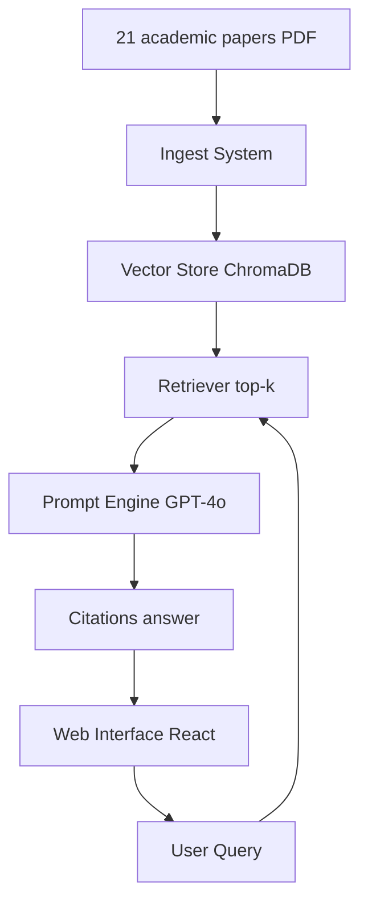

# Research Copilot: RAG Pipeline Implementation

## 🚀 Overview
Research Copilot is a conversational AI assistant designed for academic research. It uses **Retrieval-Augmented Generation (RAG)** to provide accurate, cited answers from a collection of academic papers.

## 🏗️ System Architecture



### 1. Ingestion Pipeline
1.  **Extraction**: PDF text and metadata extraction using `PyMuPDF` (fitz). [status: completed]
2.  **Preprocessing**: Cleaning text (regex normalization) and metadata enrichment. [status: completed]
3.  **Chunking**: Recursive text splitting for optimal context. [status: completed]
4.  **Embedding**: Converting text into high-dimensional vectors with OpenAI. [status: completed]

### 📊 Chunking Comparison Table
| Configuration | Size (Tokens) | Overlap | Est. Total Chunks | Best Use Case |
| :--- | :--- | :--- | :--- | :--- |
| **Small Chunks** | 256 | 30 | ~1,200 | Precise facts, specific keyword retrieval, detailed stats. |
| **Large Chunks** | 1024 | 100 | ~300 | Complex summaries, multi-part questions, thematic analysis. |


### 2. Vector Store
- **Database**: ChromaDB (Local persistent storage). [status: completed]
- **Search**: Cosine similarity retrieval with metadata filtering. [status: completed]

### 3. RAG Pipeline
- **Retriever**: Fetches relevant chunks from papers. [status: completed]
- **Generator**: GPT-4o with specialized academic prompts. [status: completed]
- **Citations**: Automatic APA formatting. [status: completed]

### 4. Web Interface
- React + Vite + Tailwind CSS. [status: deprecated in favor of Streamlit]
- **Streamlit Premium Interface**: Fully implemented with multipage support. [status: completed]
- **Features**:
    - Real-time Chat with history memory.
    - Academic Paper Browser with search/filters.
    - Plotly Analytics Dashboard.
    - System Configuration & API Management.

## 🚀 How to Run the App
1.  **Backend Setup**: Ensure you are in the `.venv` and install requirements.
    ```bash
    pip install streamlit pandas plotly chromadb openai pypdf tiktoken python-dotenv
    ```
2.  **Run Streamlit**:
    ```bash
    streamlit run app/main.py
    ```

### 🧪 Prompting Strategies Comparison
| Strategy | Strength | Token Usage | Citation Quality |
| :--- | :--- | :--- | :--- |
| **Clear Instructions (V1)** | Direct, easy to control, minimal noise. | Low | Good, standard APA. |
| **Structured JSON (V2)** | Ideal for UI integration and programatic use. | Medium | Consistent metadata structure. |
| **Few-Shot Learning (V3)** | Highest consistency for specific styles. | High | Excellent, follows examples. |
| **Chain-of-Thought (V4)** | Best for multi-layered complex questions. | High+ | Deep, contextual citations. |

### 4. Web Interface
- React + Vite + Tailwind CSS.
- Glassmorphism design elements.
- Features: Real-time chat, source viewing, and filters.

## 🛠️ Tech Stack
- **Backend**: FastAPI, LangChain, ChromaDB, PyMuPDF.
- **Frontend**: React, Framer Motion, Axios, Tailwind CSS.
- **AI**: OpenAI (GPT-4o, text-embedding-3-small).

---
*Created as part of the Prompt Engineering Course.*
